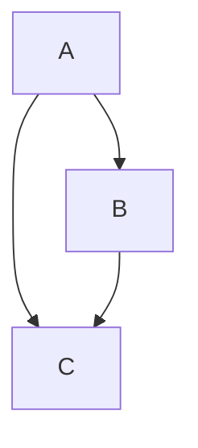
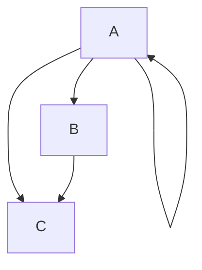
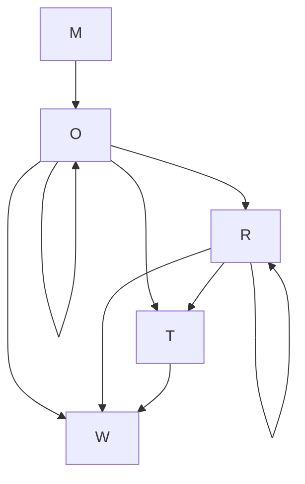
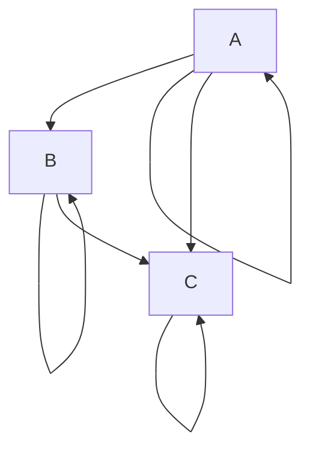
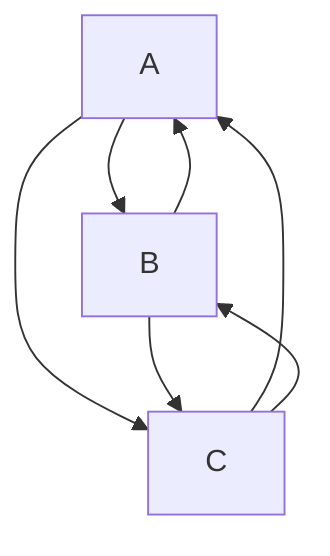

# Table of contents #
[Combinations without repetition](#h1)

[Combinations with repetition](#h2)

[Permutations without repetition](#h3)

[Permutations with repetition](#h4)

[Partial Permutations without repetition](#h5)

[Partial Permutations with repetition](#h6)

[Circular permutations](#h7)

[SuperPermutations](#h8)


# Combinations without repetition <a name="h1"></a>

## Input has no duplicates ##
>Given ***n*** unique elements, choose ***r*** elements without repetition (the same element cannot be chosen more than once).


```
EXAMPLE : In how many ways can 2 letters be selected without repetition from the set {A, B, C} ?
```

Finite state transition diagram. Starting at any node, stop when 2 letters have been selected.

Terminal :
```
Enter string : ABC
Enter value of r : 2
Choose an option :
(1) : Input string has ONLY unique elements. Choose r elements WITHOUT repetition (each element CANNOT be selected more than once)
(2) : Input string has ONLY unique elements. Choose r elements WITH repetition (each element can be selected more than once)
(3) : Input string has duplicate elements. Choose r elements (each element CANNOT be selected more than once)
1
{AB, AC, BC}
Number of selections : 3
```
## Input has duplicates ##
>Given ***n*** elements, some of which may not unique, choose ***r*** elements. You cannot use more elements than given. 

```
EXAMPLE : In how many ways can 2 letters be selected without repetition from the set {A, A, B, C} ?
```
Finite state transition diagram. Starting at any node, stop when 2 letters have been selected.


```
Enter string : AABC
Enter value of r : 2
Choose an option :
(1) : Input string has ONLY unique elements. Choose r elements WITHOUT repetition (each element CANNOT be selected more than once)
(2) : Input string has ONLY unique elements. Choose r elements WITH repetition (each element can be selected more than once)
(3) : Input string has duplicate elements. Choose r elements (each element CANNOT be selected more than once)
3
{AA, AB, AC, BC}
Number of selections : 4
```

```
EXAMPLE : In how many ways can 3 letters be selected without repetition from the set {A, A, B, C} ?
```
Finite state transition diagram. Starting at any node, stop when 3 letters have been selected.

Terminal:
```
Enter string : AABC
Enter value of r : 3
Choose an option :
(1) : Input string has ONLY unique elements. Choose r elements WITHOUT repetition (each element CANNOT be selected more than once)
(2) : Input string has ONLY unique elements. Choose r elements WITH repetition (each element can be selected more than once)
(3) : Input string has duplicate elements. Choose r elements (each element CANNOT be selected more than once)
3
{AAB, AAC, ABC}
Number of selections : 3
```
	
```
EXAMPLE : Find the number of ways to select four letters from the 8 letters of the word TOMORROW.
```
Finite state transition diagram. Starting at any node, stop when 4 letters have been selected. Only 3 Os and 2 Ts can be selected. 


```
Enter string : TOMORROW
Enter value of r : 4
Choose an option :
(1) : Input string has ONLY unique elements. Choose r elements WITHOUT repetition (each element CANNOT be 
selected more than once)
(2) : Input string has ONLY unique elements. Choose r elements WITH repetition (each element can be selected more than once)
(3) : Input string has duplicate elements. Choose r elements (each element CANNOT be selected more than once)
3
{MOOO, MOOR, MOOT, MOOW, MORR, MORT, MORW, MOTW, MRRT, MRRW, MRTW, OOOR, OOOT, OOOW, OORR, OORT, OORW, OOTW, ORRT, ORRW, ORTW, RRTW}
Number of selections : 22
```

# Combination with repetition <a name="h2"></a> 

>Given ***n*** unique elements, choose  ***r*** elements with repetition (the same element can be chosen more than once).

Two combinations with repetition are considered identical if they have the same elements repeated the same number of times, regardless of their order. 
```
EXAMPLE : In how many ways can 2 letters be selected with repetition from the set {A, B, C} ?
```
Finite state transition diagram. Starting at any node, stop when 2 letters have been selected.

Terminal :
```
Enter string : ABC
Enter value of r : 2
Choose an option :
(1) : Input string has ONLY unique elements. Choose r elements WITHOUT repetition (each element CANNOT be 
selected more than once)
(2) : Input string has ONLY unique elements. Choose r elements WITH repetition (each element can be selected more than once)
(3) : Input string has duplicate elements. Choose r elements (each element CANNOT be selected more than once)
2
{AA, AB, AC, BB, BC, CC}
Number of selections : 6
```
Notice how BA, CA, CB are missing.
```
EXAMPLE : There are 4 different flavours of candy and 3 candies are bought. What are the possible combinations of flavours?
```
Let flavours be A, B, C, D.
```
Enter string : ABCD
Enter value of r : 3
Choose an option :
(1) : Input string has ONLY unique elements. Choose r elements WITHOUT repetition (each element CANNOT be 
selected more than once)
(2) : Input string has ONLY unique elements. Choose r elements WITH repetition (each element can be selected more than once)
(3) : Input string has duplicate elements. Choose r elements (each element CANNOT be selected more than once)
2
{AAA, AAB, AAC, AAD, ABB, ABC, ABD, ACC, ACD, ADD, BBB, BBC, BBD, BCC, BCD, BDD, CCC, CCD, CDD, DDD}      
Number of selections : 20
```
```
EXAMPLE : Find the number of non-negative integer solutions of the equation a + b + c = 5.
```
Using stars and bars, the number of solutions =  `7C2`
```
Enter string : ABC
Enter value of r : 5
Choose an option :
(1) : Input string has ONLY unique elements. Choose r elements WITHOUT repetition (each element CANNOT be 
selected more than once)
(2) : Input string has ONLY unique elements. Choose r elements WITH repetition (each element can be selected more than once)
(3) : Input string has duplicate elements. Choose r elements (each element CANNOT be selected more than once)
2
{AAAAA, AAAAB, AAAAC, AAABB, AAABC, AAACC, AABBB, AABBC, AABCC, AACCC, ABBBB, ABBBC, ABBCC, ABCCC, ACCCC, 
BBBBB, BBBBC, BBBCC, BBCCC, BCCCC, CCCCC}
Number of selections : 21
```
# Permutations 
A permutation is an arrangement of elements.

## Permutations without repetition <a name="h3"></a>
>Given $n$ unique elements, find all possible arrangements. A given element cannot be used more than once.

The number of arrangements of n unique elements is n!.
```
EXAMPLE : Arrange the elements in {A, B, C}
```
Finite state transition diagram. Starting at any node, stop when 3 letters are obtained.



Terminal :
```
Enter string : ABC
Enter value of k : 3
Choose an option for permutations :
(1) Without repetition (a given element cannot be used more than once)
(2) With repetition (a given element can be used multiple times)      
1
{ABC, ACB, BAC, BCA, CAB, CBA}
Number of arrangements : 6 
```
## Permutations with repetition <a name="h4"></a>
> Given $n$ elements, some of which may be duplicates, find all possible arrangements. 

```
EXAMPLE : Arrange the elements in {A, A, B, C}
```
```
Enter string : AABC
Enter value of k : 4
Choose an option for permutations :
(1) Without repetition (a given element cannot be used more than once)
(2) With repetition (a given element can be used multiple times)      
1
{AABC, AACB, ABAC, ABCA, ACAB, ACBA, BAAC, BACA, BCAA, CAAB, CABA, CBAA}
Number of arrangements : 12
```
## Partial permutations without repetition <a name="h5"></a>
> Given  ***n*** unique elements, choose  ***k*** elements without repetition, and arrange.

```
EXAMPLE : Find the arrangements of 3 letters from {A, B, C, D, E}
```
There are $5P3$ arrangements.

Terminal:
```
Enter string  : ABCDE
Enter value of k : 3
Choose an option for permutations :
(1) Without repetition (a given element cannot be used more than once)
(2) With repetition (a given element can be used multiple times)      
1
{ABC, ABD, ABE, ACB, ACD, ACE, ADB, ADC, ADE, AEB, AEC, AED, BAC, BAD, BAE, BCA, BCD, BCE, BDA, BDC, BDE, 
BEA, BEC, BED, CAB, CAD, CAE, CBA, CBD, CBE, CDA, CDB, CDE, CEA, CEB, CED, DAB, DAC, DAE, DBA, DBC, DBE, DCA, DCB, DCE, DEA, DEB, DEC, EAB, EAC, EAD, EBA, EBC, EBD, ECA, ECB, ECD, EDA, EDB, EDC}
Number of arrangements : 60
```


## Partial permutation with repetition <a name="h6"></a>
>Given  ***n*** unique elements, choose  ***k*** elements with repetition, and arrange.

The number of arrangements is $n^k$. 

```
Enter string : ABCD
Enter value of k : 3
Choose an option for permutations :
(1) Without repetition (a given element cannot be used more than once)
(2) With repetition (a given element can be used multiple times)      
2
{AAA, AAB, AAC, AAD, ABA, ABB, ABC, ABD, ACA, ACB, ACC, ACD, ADA, ADB, ADC, ADD, BAA, BAB, BAC, BAD, BBA, 
BBB, BBC, BBD, BCA, BCB, BCC, BCD, BDA, BDB, BDC, BDD, CAA, CAB, CAC, CAD, CBA, CBB, CBC, CBD, CCA, CCB, CCC, CCD, CDA, CDB, CDC, CDD, DAA, DAB, DAC, DAD, DBA, DBB, DBC, DBD, DCA, DCB, DCC, DCD, DDA, DDB, DDC, DDD}
Number of arrangements : 64
```

# Circular permutations <a name="h7"></a>
> Arrange $n$ unique elements around a circle.

There are $(n-1)!$ arrangements.

```cpp
Arrangements of  {A, B, C, D} in a circle :

    A  |   A  |  A  |  A  |  A  |  A
   B C |  B D | C B | C D | D C | D B
    D  |   C  |  D  |  B  |  B  |  C

Notice that only {B, C, D} are being arranged relative to A.
```
To find the circular arrangements of n elements,  find the permutationas of $n-1$ elements then add the $n$-th element to each of the arrangements.

```
EXAMPLE : In how many ways can the numbers 1-10 be written in 4 sectors of a circle such that the sum of any 3 consecutive sectors is less than 19?
```
Answer = 54. Run code from `CyclicPermutationProblem.cpp`

# Superpermutations <a name="h8"></a>

>A superpermutation of ***n*** symbols is a string that contains each permutation of n symbols as a substring. 
For example, for 3 symbols (123) there are $3!$ or 6 different permutations containing each of the symbols, 123, 132, 213, 231, 312, and 321. A superpermutation is a string containing all of these n! permutations, such as 123121321.

```
Superpermutations
1 term  : 1
2 terms : 121
3 terms : 123121321
4 terms : 123412314231243121342132413214321
```

## Resources ##
http://superpermutation.com/

https://rosettacode.org/wiki/Superpermutation_minimisation#C.2B.2B


https://www.youtube.com/watch?v=wJGE4aEWc28

https://www.youtube.com/watch?v=OZzIvl1tbPo

# Future work # 
- [ ] Add more code explanation
